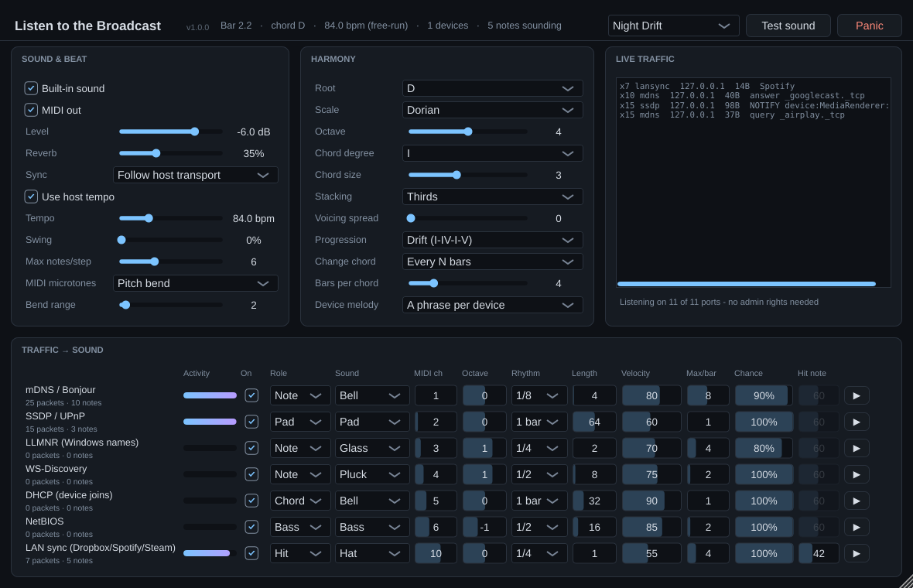

# Listen to the Broadcast

**An ambient VST3 instrument that plays your local network.**

Your network never stops talking to itself:
- speakers and TVs announcing AirPlay and Chromecast,
- printers saying hello,
- Windows PCs looking up each other's names,
- Spotify and Dropbox beaconing,
- phones joining the Wi-Fi.

Listen to the Broadcast hears that chatter and turns it into slow, evolving music, on the beat and in the scale you choose.



## What it does

- **Plays straight away.** It has its own voices (bell, pluck, pad, glass, bass, hi-hat) and reverb. It can also send MIDI to drive your other instruments.
- **Runs entirely inside the plugin.** No helper app, no virtual MIDI cables, no admin rights and no packet capture. It only *listens*, using ordinary network sockets, and never sends anything.
- **Stays on the beat.** It follows your host's tempo and transport. When the host is stopped (VSTHost usually is), it keeps playing on its own clock.
- **Has about 50 scales from many traditions:**
  - Western modes, pentatonics, blues, whole tone and diminished
  - Middle Eastern: Hijaz, Double Harmonic, Nahawand, Kurd, Nikriz, Persian
  - **True quarter-tone Arabic maqamat:** Rast, Bayati, Saba, Sikah
  - Hungarian minor and Ukrainian Dorian
  - Hindustani thaats: Bhairav, Todi, Purvi, Marwa, Kalyan…
  - Japanese and Chinese pentatonics
  - Pelog and Slendro
- **Chord controls:** degree, size, stacking (thirds, fourths, fifths, clusters), voicing spread, a progression, and when to change chord (every N bars, or when a new device joins the network).
- **Gives every device its own voice.** Each machine on your network gets a home note and a short phrase of its own, so after a while you can hear which device is talking.
- **Seven factory presets:** Night Drift, Maqam Rast, Kyoto Garden, Raga Todi, Gamelan, Sparse Bells and Pulse.
- **Stops cleanly.** Remove the plugin or close the host and everything stops. **Panic** silences every note instantly.

## Install (Windows)

1. Download **`ListenToTheBroadcast-VST3-Windows.zip`**. Get it from this repo's [Releases](../../releases) page, or from the latest green run of the **build** workflow under [Actions](../../actions/workflows/build.yml).
2. Unzip it and copy the **`Listen to the Broadcast.vst3`** folder into:
   ```
   C:\Program Files\Common Files\VST3\
   ```
3. In **VSTHost** (a version with VST3 support) or your DAW, rescan plugins and load **Listen to the Broadcast** as an instrument.
4. When **Windows Firewall** asks whether your host may receive network traffic, allow **Private networks**. Without this the plugin hears nothing. It never sends anything.
5. Press **Test sound**. Then wait: most networks chatter every few seconds.

To uninstall, delete that folder.

### "Windows flagged it as a virus"

This plugin is a new, **unsigned** file that very few people have downloaded yet. Windows judges downloads partly by reputation and by code-signing certificate, so new unsigned files often get warnings:
- **SmartScreen** ("Windows protected your PC") warns about unfamiliar downloads.
- **Microsoft Defender** sometimes flags them with a generic machine-learning detection, particularly a DLL that opens network sockets.

The build itself is transparent:
- It's built from this source code by GitHub Actions, in public.
- It contains no packer or obfuscation.
- It never writes to disk, and never sends anything over the network.

To check your download:
1. Compare the zip's SHA-256 against the `.sha256` file published with it:
   ```powershell
   Get-FileHash .\ListenToTheBroadcast-VST3-Windows.zip -Algorithm SHA256
   ```
2. If it matches and you trust the source, use **Properties → Unblock** on the zip before extracting. In Defender, you can **Allow** the item.
3. If Defender quarantined it, please [report the false positive to Microsoft](https://www.microsoft.com/en-us/wdsi/filesubmission) (choose "Software developer" or "Home customer"). Each report builds the file's reputation for everyone.

The permanent fix is signing releases with a code-signing certificate, for example Azure Trusted Signing or the free SignPath program for open-source projects. The build workflow has a clear place to add a signing step once a certificate is available.

## Using it

| Area | What's there |
|---|---|
| **Header** | Bar and beat, current chord, tempo (host or free-run), devices heard, notes sounding. **Preset** menu, **Test sound**, **Panic**. |
| **Sound & Beat** | Built-in sound on/off, MIDI out on/off, level, reverb, sync, tempo, swing, notes per step, and how MIDI handles microtones. |
| **Harmony** | Root, scale (grouped by tradition; ¼ marks quarter-tone scales), octave, chord degree, size, stacking, spread, progression, chord changes, and device melody. |
| **Live traffic** | Packets as they arrive; repeats are merged with a count (`x15`). Also shows which ports are open. |
| **Traffic → Sound** | One row per traffic type: activity meter, packet and note counts, on/off, role, sound, MIDI channel, octave, rhythm, length, velocity, max per bar, chance, and ▶ to test that row. |

Every control is a normal plugin parameter. Your host saves them with the project and can automate them.

### Traffic types and default sounds

| Traffic | What it is | Role | Sound | MIDI ch |
|---|---|---|---|---|
| mDNS / Bonjour | AirPlay, Chromecast, printers, phones advertising services | note (each device its own phrase) | Bell | 1 |
| SSDP / UPnP | Smart TVs, routers, media servers | pad (breathes while there's traffic) | Pad | 2 |
| LLMNR | Windows PCs looking up names | note | Glass | 3 |
| WS-Discovery | Printers, scanners, cameras | note | Pluck | 4 |
| DHCP | A device joining the network | chord | Bell | 5 |
| NetBIOS | Older Windows file-sharing chatter | bass | Bass | 6 |
| LAN sync | Dropbox, Spotify and Steam beacons | hit | Hat | 10 |

**Roles:**
- **Note:** a device's own phrase.
- **Chord:** the current chord, struck.
- **Pad:** the current chord, sustained while that traffic continues.
- **Bass:** the chord's root.
- **Hit:** a fixed note, e.g. for drums.

### Tips

- **A row that's too busy:** lower **Max/bar** or **Chance**, or pick a slower **Rhythm**.
- **One device repeating itself:** leave **Device melody** on "A phrase per device".
- **Hear which devices join:** set **Change chord** to "When a new device appears".
- **A port shows "held by another app":** that app (Steam on 27036, for example) keeps it to itself. Every other traffic type still works.
- **Your own instruments:** turn on **MIDI out** and route the plugin's MIDI to them. Each traffic type plays on its own channel. Set a row's sound to **MIDI only** to mute its built-in voice. For quarter-tone scales, set your synth's pitch-bend range to match **Bend range**; chords round to the nearest semitone over MIDI.

## How it works

```
Network thread (plain UDP sockets, multicast joined on every network adapter)
  mDNS 5353 · SSDP 1900 · LLMNR 5355 · WS-Discovery 3702 · DHCP 67/68 · NetBIOS 137/138
  Dropbox 17500 · Spotify 57621 · Steam 27036
        │  lock-free queue: never blocks audio, drops when full
        ▼
Audio thread (no locks, no allocation)
  16th-note grid from the host's position (or the plugin's own clock), swing
  harmony: scale + progression → chord; device address → home note + phrase
  roles → notes → built-in synth + reverb, and MIDI out
```

**Privacy:** the plugin only reads broadcast and multicast traffic that already reaches your computer. It keeps no logs, stores nothing on disk, and shows addresses only in its own window.

The design notes and prior art are in [docs/architecture-evaluation.md](docs/architecture-evaluation.md).

## Building from source

You need CMake 3.22+ and a C++17 compiler (Visual Studio 2022 on Windows; GCC or Clang elsewhere). JUCE 8 is downloaded automatically.

```sh
cmake -S . -B build
cmake --build build --config Release --target ListenToTheBroadcast_VST3
```

The plugin is written to `build/ListenToTheBroadcast_artefacts/Release/VST3/`.

### Tests

```sh
cmake --build build --config Release --target ltb_core_tests ltb_plugin_tests
build/ltb_core_tests                                          # Windows: build\Release\ltb_core_tests.exe
build/ltb_plugin_tests_artefacts/Release/ltb_plugin_tests     # optional: pass a .png path to render the window
```

- **`ltb_core_tests`** covers the timing grid, scales, chords, progressions, pads, motifs, the synth, and the network listener on real sockets.
- **`ltb_plugin_tests`** drives the actual plugin offline. It checks sound and MIDI, host sync, the presets, save and restore, panic, and shutdown time.

**CI** (`.github/workflows/build.yml`) runs on every push, on Windows and Linux. It builds, runs both test suites, and validates the plugin with [pluginval](https://github.com/Tracktion/pluginval) at its strictest level. The Windows job uploads the plugin zip and its checksum. Pushing a tag such as `v1.0.0` also publishes them as a GitHub Release.

## License

GPL-3.0-or-later (see [LICENSE](LICENSE)). Built with [JUCE](https://juce.com) (AGPLv3) and the Steinberg VST3 SDK (MIT).
